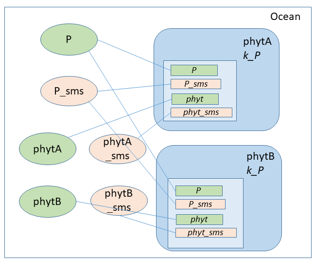

# PALEOboxes coupler design
```@meta
CurrentModule = PALEOboxes
```
A PALEO [`Model`](@ref) contains [`Domain`](@ref)s, each of which contain Variables defining [`Field`](@ref)s containing `Data` arrays, and Reactions with [`ReactionMethod`](@ref)s that operate on the Variables to calculate model time evolution.

The PALEOboxes Julia package (abbreviated to `PB` in the PALEO code) implements a coupler that provides a unified mechanism for
1. ‘low-level’ coupling (e.g. linking individual redox Reactions within a [`Domain`](@ref)), on which is built
2. ‘module-level’ coupling (linking e.g. atmosphere and ocean components) based on standardising names for communicating fluxes, and which enables
3. separation of biogeochemical reaction and transport. 

A [YAML](https://en.wikipedia.org/wiki/YAML) format configuration file then defines both the model structure (spatial domains containing biogeochemical variables and reactions that operate on them) and model parameter values.

## Composing Reactions and Variables within a [`Domain`](@ref)
###### Figure 1


*The PALEOboxes object model illustrated by a fragment of a marine biogeochemical model representing two phytoplankton populations competing for the same nutrient. The Ocean Domain contains two Reactions phytA and phytB, and three state Variables P, phytA and phytB with paired time derivatives P\_sms, phytA\_sms and phytB\_sms. The Reactions are both instances of the same class PaleoReactionSimplePhyt, with a Parameter k\_P, and a single method. The ReactionMethod defines interactions with a nutrient P via a Variable Dependency P and a Variable Contributor P\_sms, and a population represented by Variable Dependency phyt and Contributor phyt\_sms. P and P\_sms from each PaleoReactionSimplePhyt instance are linked at run time to the same Domain Variables P and P\_sms, using the default names from the PaleoReactionSimplePhyt code.  phyt and phyt\_sms are renamed in the configuration file to two different pairs of Domain Variables phytA, phytA\_sms and phytB, phytB\_sms, hence representing two distinct phytoplankton populations.*

### Reactions and ReactionMethods
Reactions contain [`Parameter`](@ref)s and are implemented as subtypes of [`AbstractReaction`](@ref) along with associated methods. [`ReactionMethod`](@ref)s and [`VariableReaction`](@ref)s are created by Reactions during model initialization. All PALEO model time evolution (including external prescribed forcing, biogeochemistry, transport within eg an ocean Domain) is then implemented by the [`ReactionMethod`](@ref)s as they are called during the model main loop.

### Biogeochemical Variables
Variables defined as [`VariableReaction`](@ref)s are then linked within (or across) Domains, creating corresponding [`VariableDomain`](@ref)s.  Linking of Variables is based on names (as text strings).  Default names are encoded in the Reaction implementations (with standard names for e.g. chemical species such as O2, DIC marine tracers), and can be overridden in the configuration file.  This is analogous to the use of ‘dummy variables’ in a Fortran or Python function  call, and allows (i) a combination of default names for commonly-used biogeochemical variables (‘P’, ‘SO4’ etc), with (ii) renamed variables to allow multiple Reaction instances (e.g. two phytoplankton populations with state variable names and parameter choices for the same Reaction implementation),  or (iii) enable rerouting of fluxes and dependencies that are specific to the model configuration, or (iv) sort out name conflicts where no default names have been established.

Variables are classified into two pairings: Properties with Dependencies (shown shaded green in [Figure 1](@ref), linked at run time to [`Domain`](@ref) [`VariableDomPropDep`](@ref)s),  or flux Targets and Contributors (shaded pink in [Figure 1](@ref), linked at run-time to [`Domain`](@ref) [`VariableDomContribTarget`](@ref)s). This classification retains flexibility while providing sufficient information to allow automatic detection of errors in model specification (for example, a Dependency with no Property, or a flux Contributor with no Target), and automatic scheduling of Reactions within the model main loop (as a Reaction that defines a Property must be executed before a Reaction that Depends on this property).

Variables can specify metadata as an extensible list of attributes which can then be queried (using [`get_attribute`](@ref)) and filtered on (using [`get_variables`](@ref)) during model configuration and initialisation. This enables the labelling of groups of variables (e.g. the `:advect` and `:vertical_motion` attributes are used by a Reaction implementing ocean transport to identify those state variables representing solutes that should be transported; the `:vfunction` attribute is used by numerical solvers to identify state variables and their time derivatives).

### Spatially-resolved Domains and Grids
Domains may contain a Grid (a subtype of [`AbstractMesh`](@ref)) to define a spatially-resolved Domain containing multiple cells.

Three-dimensional [`Domain`](@ref)s (eg ocean) are associated with two-dimensional boundary [`Domain`](@ref)s (eg oceansurface, oceanfloor), and also provide [Subdomains](@ref) (subtypes of [`AbstractSubdomain`](@ref), eg ocean.oceansurface, ocean.oceanfloor) that specify the subset of 3D ocean cells adjacent to the 2D boundaries.

### Fields and Data 
Variables contain [`Field`](@ref)s which represent data (a subtype of [`AbstractData`](@ref) defined by the `:field_data` ttribute) in a function space (a subtype of [`AbstractSpace`](@ref) defined by the `:space` attribute).

The [`AbstractSpace`](@ref) subtype (see [Spaces](@ref)) can define a per-Domain ([`ScalarSpace`](@ref)) or per-cell ([`CellSpace`](@ref)) quantity, where the number of cells is defined by the Domain grid.

The [`AbstractData`](@ref) subtype (see [Data types](@ref)) defines the information that is stored per Domain or per grid cell. [`ScalarData`](@ref) defines one value, [`ArrayScalarData`](@ref) an array of scalar values eg for intensity on a wavelength grid, and [`AbstractIsotopeScalar`](@ref) a multiple-component isotope system (see [Isotopes](@ref)).

## Coupling Spatial Domains
###### Figure 2


*Defining and coupling spatial Domains.  The four Domains atm, oceansurface, ocean and fluxAtmOceansurface are defined in the model configuration file. The first three of these contain arbitrary biogeochemical Reactions and Variables. Domain fluxAtmOceansurface contains only a FluxTarget Reaction and a set of Target Variables flux_O2. Exchange fluxes are accumulated into these flux_ Variables (in this case, produced by air-sea exchange reactions in the oceansurface Domain), and then redistributed to atm and ocean by the FluxTransfer Reactions taking account of mapping between Domain dimensions.*

Coupling between Earth system components is provided by [Fluxes](@ref), implemented by [`Fluxes.ReactionFluxTarget`](@ref)s ([Figure 2](@ref)) that provide a set of flux Target Variables in nominated flux coupler [`Domain`](@ref)s, and [`Fluxes.ReactionFluxTransfer`](@ref) that then transfer fluxes (with appropriate mapping) to a different [`Domain`](@ref).

Variable text names may be referred to from other [`Domain`](@ref)s by prefixing with Domain and Subdomain names (eg ocean.P\_conc links to the 3D ocean interior Variable P\_conc, ocean.oceansurface.O2\_conc links to the ocean oxygen concentration for the 2D subset of ocean cells adjacent to the oceansurface boundary).

## Separating time integration, reaction, and transport
###### Figure 3

*Examples of model configurations with different reaction/transport partitioning: a) a configuration with offline transport and forcing provided by Reactions within the PALEO framework. The only external dependencies are state variables and derivatives, with time integration provided by a standard ODE solver such as CVODE and the overall model workflow (initialisation, solution, output) managed by the PALEOmodel package. b) an ocean-only model embedded in a GCM host which provides transport and physical properties such as temperature and sequences the model workflow.*

The `:vfunction` Variable attribute is used to identify pairs of state variables (labelled with `:vfunction = VF_StateExplicit`) and their corresponding time derivatives (labelled with `:vfunction = VF_Deriv`). Algebraic constraints are defined by Variables labelled with `:vfunction = VF_Constraint`, with a corresponding number of state variables labelled with `:vfunction = VF_State`. Implicit variables are defined by pairs of variables and time derivatives labelled with `:vfunction = VF_Total` and  `:vfunction = VF_Deriv`, with a corresponding number of state variables labelled with `:vfunction = VF_State`. 

To access variables, a numerical ODE or DAE solver can use [`SolverView`](@ref) which provides a high-level interface to aggregated lists. A host dynamical model can alternatively use [`get_variables`](@ref) during model configuration and initialisation to link to individual host data arrays.  

The abstractions described above enable a natural separation of biogeochemical reaction and transport, which can then either be provided by a host dynamical model e.g. implemented in C or Fortran, or as offline transport implemented by PALEO “reactions” within the framework ([Figure 3](@ref)). This enables both rapid, interactive development and experimentation in a PC/workstation environment using offline transport, and deployment of the same model code as a component embedded in a larger GCM model.


